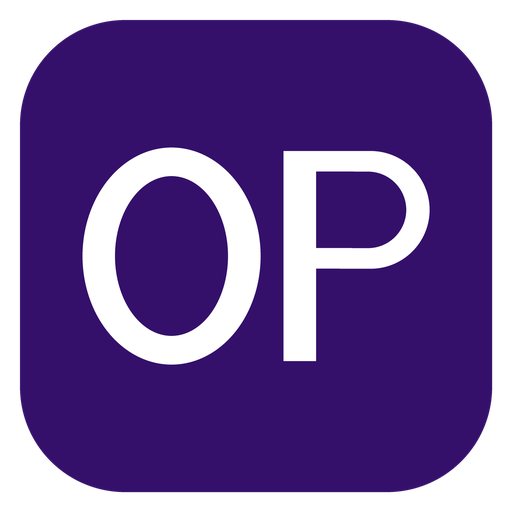
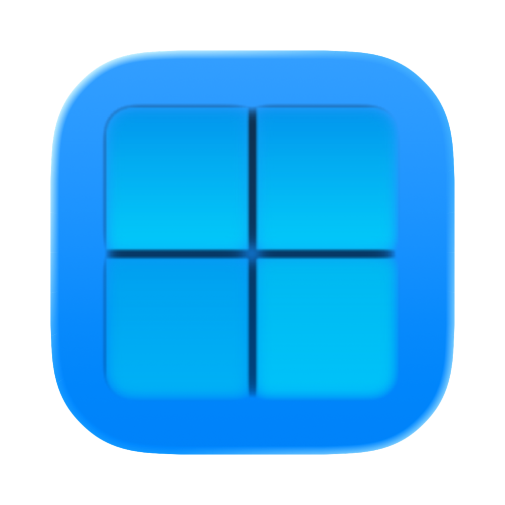
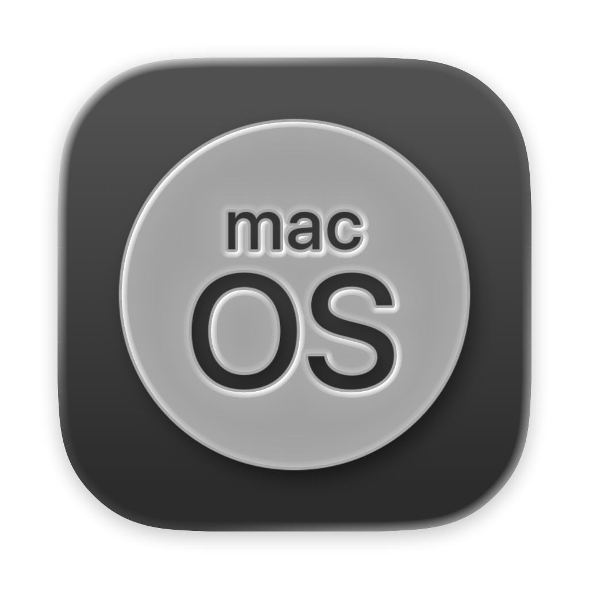

<p align="center">
  
</p>

<h1 align="center">OpenPremier</h1>

<p align="center">
  Editor de vídeo no lineal, libre y de código abierto, desarrollado principalmente en Rust.
</p>

<p align="center">
  <a href="https://github.com/xXKuroiKenshiXx/OpenPremier/actions/workflows/ci_build.yml"></a>
  <a href="LICENSE"></a>
  <a href="https://github.com/xXKuroiKenshiXx/OpenPremier/releases"></a>
</p>

OpenPremier busca ofrecer un entorno de edición profesional con una organización y un flujo de
trabajo familiares para quienes vienen de otros editores no lineales. El proyecto es independiente,
no contiene código ni recursos de Adobe y no está afiliado con Adobe Inc.

<p align="center">
    
</p>

## Estado actual

La versión `0.7.0` es una versión alfa funcional para Windows, Linux y macOS. La aplicación ya se puede
compilar, abrir, probar y empaquetar, pero todavía no está lista para sustituir un editor comercial
en todos los trabajos de producción.

### Funciones disponibles

- Timeline multipista con insert, overwrite, razor, ripple, roll, slip, slide, rate stretch,
  snapping, nesting, marcadores, transiciones y keyframes.
- Paneles acoplables para Proyecto, Source, Program, Timeline, Effect Controls, Effects, History,
  Audio Mixer, Meters, Markers, Info, Lumetri, Scopes, Graphics, Subtítulos y Tools.
- Lectura, decodificación y exportación multimedia mediante FFmpeg, con exportación que se puede
  pausar, vista previa de los fotogramas renderizados y velocidad de fotogramas configurable.
- Composición por GPU mediante `wgpu`, con Vulkan, Direct3D 12, Metal u OpenGL (se elige en
  Preferencias).
- Decodificación de vídeo por procesador o por la tarjeta gráfica, con modo automático.
- Cinco perfiles de rendimiento, de Ultra rendimiento a Calidad máxima, elegidos automáticamente
  según el procesador, la memoria y la tarjeta gráfica, o ajustados uno por uno; funciona incluso
  en equipos sin tarjeta gráfica (modo Solo software).
- Subtítulos animados automáticos al estilo TikTok: la voz de la secuencia se transcribe en el
  propio equipo y cada palabra se ilumina, crece o aparece a medida que se dice, con 12 estilos
  (karaoke, caja resaltada, pop, palabra a palabra, neón, creador...), en el idioma hablado o
  traducidos al inglés. El panel Subtítulos cambia el estilo de todos a la vez y permite corregir
  el texto. También importa y exporta SRT y WebVTT.
- Vincular medios: si los archivos se movieron, se ubican a mano o se buscan solos en el equipo.
- Proxies como en Premiere Pro: copias ligeras de los clips para editar con fluidez material 4K o
  de cámara, con un botón para alternar entre proxies y originales; la exportación usa siempre el
  original.
- Efectos de estilo (resplandor, fallo digital, temblor de cámara, grano, VHS, película antigua,
  fugas de luz, semitono, duotono, pintura al óleo, boceto a lápiz, neón, destello de lente,
  pantalla CRT...), transiciones de zoom, giro, destello, hexágonos, cristales rotos y tinta, y
  ajustes preestablecidos de animación listos para arrastrar.
- Efectos de audio para voces y música: cambio de tono, teléfono y radio, trémolo, phaser,
  distorsión, reductor de bits y puerta de ruido, además de ecualización, dinámica y reverberación.
- Mezclador de audio en punto flotante, medidores y salida a dispositivos.
- Formato nativo `.opproj`, intercambio OTIO/FCP XML/EDL e importación parcial de `.prproj`; los
  efectos y transiciones que no existen tal cual se sustituyen por el equivalente más cercano.
- Interfaz en español e inglés e importación de mapas de teclado `.kys`.
- Pegado de imágenes con Ctrl+V desde el navegador, otros programas o el explorador de archivos:
  la imagen se guarda, se importa y queda lista en la línea de tiempo.
- Recuperación automática del proyecto ante fallos y registro de actividad configurable desde
  Preferencias.
- Paquete ZIP portátil para Windows, AppImage para Linux e imagen de disco `.dmg` para macOS
  (Apple silicon e Intel).

### Trabajo pendiente

- La importación `.prproj` es parcial y de sólo lectura.
- Aún faltan OpenFX, scripting Wasm, VST3 y parte del catálogo de efectos.
- Faltan pruebas más amplias de color, audio envolvente, múltiples monitores y distintos modelos de
  GPU.
- Todavía se deben completar las pruebas de compatibilidad y rendimiento para proyectos grandes.

Lo que viene, en orden de prioridad, está en [docs/roadmap.md](docs/roadmap.md), y el detalle
técnico en [docs/implementation-status.md](docs/implementation-status.md).

## Descargar

Los instaladores y paquetes publicados estarán disponibles en
[GitHub Releases](https://github.com/xXKuroiKenshiXx/OpenPremier/releases).

Cada versión incluye:

- `OpenPremier-<versión>-windows-x64.zip`
- `OpenPremier-<versión>-x86_64.AppImage`
- `OpenPremier-<versión>-macos-arm64.dmg` (Apple silicon) y `OpenPremier-<versión>-macos-x86_64.dmg` (Intel)
- `SHA256SUMS.txt`

## Compilar desde el código fuente

Se necesita Git y Rust `1.98.1` o posterior. El comando `xtask` descarga y configura las
dependencias nativas necesarias:

```text
cargo xtask build --release
cargo xtask test
cargo xtask lint
```

Para generar los paquetes de distribución:

```text
cargo xtask dist
```

En Windows, la creación del AppImage utiliza la distribución WSL `OpenPremier-Build` y Podman.
En macOS se usa el FFmpeg de Homebrew (`brew install ffmpeg dylibbundler pkg-config`).
Los resultados se guardan en `dist/`.

## Comprobar un paquete

```text
OpenPremier.exe --self-test
APPIMAGE_EXTRACT_AND_RUN=1 ./OpenPremier-0.7.0-x86_64.AppImage --self-test
```

La prueba comprueba las bibliotecas de FFmpeg, los codificadores requeridos, la creación del
adaptador gráfico y una operación básica del compositor.

## Estructura del proyecto

| Ruta | Contenido |
|---|---|
| `crates/op-core` | Modelo de proyecto, tiempo exacto, parámetros, validación e historial |
| `crates/op-timeline` | Operaciones y navegación de la Timeline |
| `crates/op-project` | Formatos de proyecto e intercambio |
| `crates/op-media` | Lectura, decodificación, caché y codificación con FFmpeg |
| `crates/op-render` | Compositor GPU, efectos, transiciones, gráficos y scopes |
| `crates/op-audio` | Mezclador, DSP, medidores y dispositivos de audio |
| `crates/op-application` | Comandos, reproducción, autosave, preferencias y exportación |
| `crates/op-ui` | Interfaz, paneles, monitores, Timeline, diálogos e idiomas |
| `crates/openpremier` | Ejecutable, modo portátil, diagnóstico y self-test |
| `xtask` | Automatización de compilación, pruebas y paquetes |
| `docs` | Arquitectura, formatos, compatibilidad y estado técnico |

## Contribuir

Antes de enviar cambios, revisa [CONTRIBUTING.md](CONTRIBUTING.md) y ejecuta:

```text
cargo xtask lint
cargo xtask test
```

Los problemas de seguridad deben comunicarse siguiendo [SECURITY.md](SECURITY.md), no mediante un
issue público.

## Licencia

OpenPremier se distribuye bajo la licencia
[GNU General Public License 3.0 o posterior](LICENSE).

## ⚠️ Aviso Legal / Disclaimer

**OpenPremier** es un proyecto de código abierto desarrollado de forma 100% independiente. Este software **no tiene ninguna relación, afiliación, patrocinio ni respaldo por parte de Adobe Systems Incorporated**. 

No utilizamos, distribuimos ni tenemos acceso a ningún código fuente de Adobe Premiere Pro ni de ningún otro producto de Adobe. OpenPremier ha sido construido desde cero por la comunidad y para la comunidad, sirviendo únicamente como una inspiración basada en los estándares de la industria de la edición de video para ofrecer una alternativa libre y accesible. 

*Los nombres "Adobe" y "Premiere Pro" son marcas registradas de sus respectivos propietarios y se mencionan en este proyecto de manera puramente descriptiva y de referencia.*
